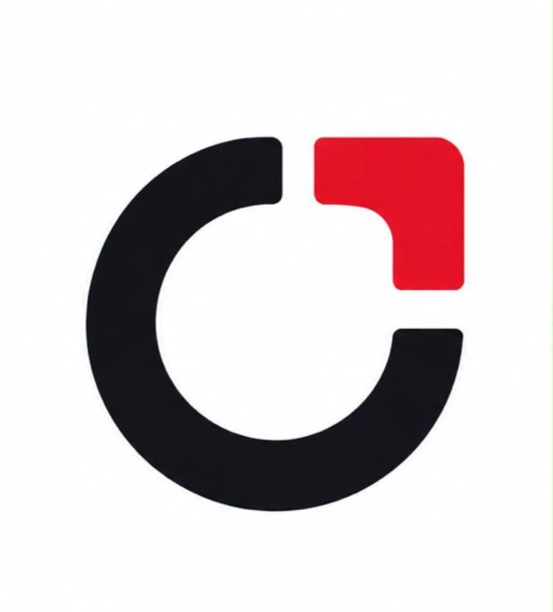

<h1 align="center">
  
</h1>

<h3 align="center">
  Crafti Studio Website
</h3>

[](https://craftistudio.tech)

---

This project is the official website for Crafti Studio.

---

# 🔥 Live version
Check it out [here](https://craftistudio.tech)

# ⚛ About the project
This project is built using Nextjs, Context API, styled-components, framer-motion, canvas and more!

# 💻 Running the project

### With Yarn

```bash
yarn dev
```

### With NPM
```bash
npm run dev
```

# 📗 License

Released in 2020

This project is under the [MIT license](./LICENSE) and uses [Crafti Studio](https://craftistudio.tech/our_studio) as a source.

Made with 🖤 by crafti one
